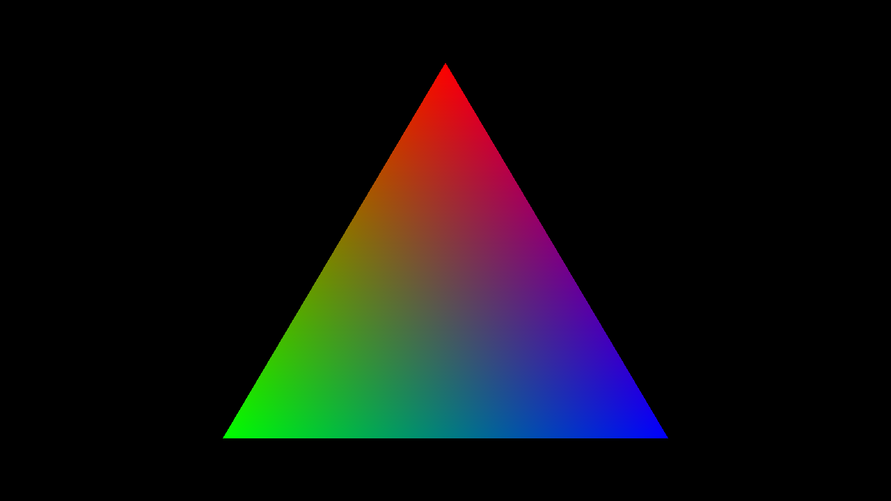
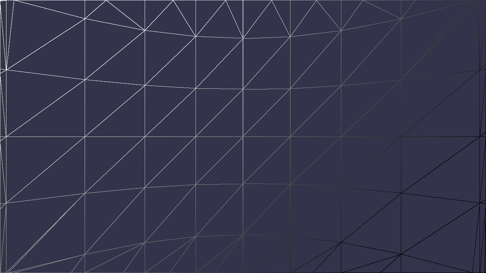
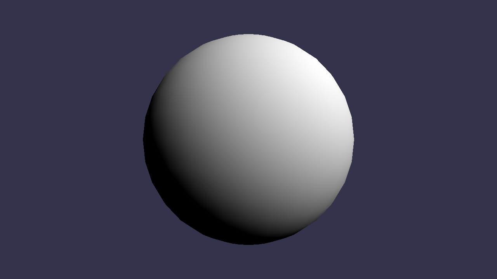

<h1 align="center">Hackri</h1>
<p align="center"></p>
<p align="center">C++编写的CPU光栅化渲染器（玩具）</p>

## About
从头做一个软渲染来理解光栅渲染管线内部做了什么事情

取这个名字是因为觉得相对于光线追踪来说，光栅化渲染做的事情有很多hack（

使用C++ 17

为啥用C++呢，我们要面对困难！不要怕！写炸了就摆（不是

## Dependence

None.（哼哼~自己造轮子（叉腰））

## Features

* 画直线（Bresenham算法）
* 可编程渲染管线（不过只有VS和PS）（其他着色器也没必要出现吧，大概）
* 齐次坐标裁剪（Sutherland-Hodgeman算法）
* 深度测试
* 透明度测试、透明度混合
* NDC空间下的背面剔除
* 透视矫正
* 重心坐标插值

## TODO
* Multi Sampling Anti-Aliasing
* Texture Filtering
  * Nearest
  * Bilinear
  * Mipmap and Trilinear
* Shadow Map
* Tangent Space Normal Map
* Cube Map
* Light
  * Directional Light
  * Point Light
  * Spot Light
* Illumination Models
  * Blinn-Phong Reflection Model
  * Physically Based Shading
* Post Processing
  * Tone Mapping
  * Bloom
  * Ambient Occlusion
  * Depth of Field
  * Screen Space Reflection（what？）


## Getting Started
CMake工程，没有特殊的环境配置，直接

```bash
mkdir build
cmake ..
```

就完事了

`app`目录下是可执行程序的源码，`hackri`是app需要的lib源码

## Reference

（没有排名，非常感谢各位大佬开源的代码、文章、视频）

#### 教程

* [GAMES101-现代计算机图形学入门-闫令琪](https://www.bilibili.com/video/BV1X7411F744)

#### 工程参考

* [renderer](https://github.com/zauonlok/renderer)
* [tinyrenderer](https://github.com/ssloy/tinyrenderer)
* [RenderHelp](https://github.com/skywind3000/RenderHelp)
* [TinySoftRenderer](https://github.com/ZeusYang/TinySoftRenderer)

#### 文章

* [计算机图形学补充2：齐次空间裁剪(Homogeneous Space Clipping)](https://zhuanlan.zhihu.com/p/162190576)
* [一篇文章彻底弄懂齐次裁剪](https://zhuanlan.zhihu.com/p/102758967)
* [计算机图形学补充1：重心坐标(barycentric coordinates)详解及其作用](https://zhuanlan.zhihu.com/p/144360079)
* [计算机图形学六：透视矫正插值和图形渲染管线总结](https://zhuanlan.zhihu.com/p/144331875)
* [图形学底层探秘 - 更现代的三角形光栅化与插值算法的实现与优化](https://zhuanlan.zhihu.com/p/140926917)
* [图形学基础拾遗 - 重新认识剪不断理还乱的矩阵变换](https://zhuanlan.zhihu.com/p/223033896)

## License

MIT

## Gallery

### Line & Cull



摄像机在球内部。这张放得大一点，可以看清楚齐次空间裁剪的结果（顺便展示画线也可以插值）

### Simple Light



lambert，简单算一下入射光和法线夹角的cos值，作为颜色三个分量输出（当然，不会让它小于0的）

### Hello World


应该是任何一个图形API入门的时候都会画的三角形了233

